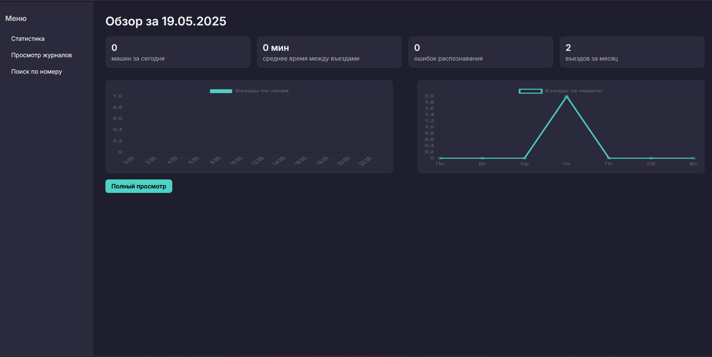

# 🚗 Vehicle Monitoring Dashboard

Это веб-приложение на Flask, предназначенное для мониторинга и анализа данных о транспортных средствах. Приложение собирает, хранит и визуализирует информацию о номерах автомобилей, цвете, типе, а также изображения номеров и самих машин. Основное применение — системы видеонаблюдения, автоматическое распознавание номеров (ANPR/ALPR), контроль въезда и выезда, охраняемые парковки и пр.

## 🔧 Возможности

- 📊 **Дашборд** — аналитика в реальном времени по количеству записей, ошибкам распознавания, суточной и недельной активности.
- 📂 **Работа с таблицами** — просмотр, поиск, фильтрация и удаление записей в выбранной таблице.
- 🔍 **Поиск по номеру** — ищите автомобиль по номерному знаку с возможностью просмотра изображений.
- 📸 **Загрузка изображений** — API принимает изображения автомобилей и номеров в Base64, сохраняет их и записывает информацию в базу данных.
- 🧾 **Журналы** — список доступных таблиц (камер, зон и т.п.) с их удобными именами.
- 🛠️ **REST API** — endpoints для получения, добавления, обновления и удаления записей.
- 🛡️ **Admin-панель** — через Flask-Admin (настраивается в `admin_panel.py`).


## 📁 Структура проекта

```bash
.
├── app.py                # Основной файл приложения Flask
├── databaseMySQL.py      # Работа с базой данных (CRUD)
├── models.py             # SQLAlchemy модели
├── utils.py              # Вспомогательные функции для аналитики
├── settings.py           # Конфигурация подключения к MySQL
├── templates/            # HTML-шаблоны для дашборда, поиска и таблиц
├── static/uploads/       # Каталог для хранения изображений
```

## 📦 Зависимости

- Flask
- Flask-SQLAlchemy
- Flask-Admin
- mysql-connector-python
- base64, datetime, os, etc.

Установите зависимости через pip:

```bash
pip install -r requirements.txt
```

## 🧪 Примеры API-запросов

### Добавить новую запись:

```http
POST /oko161
Content-Type: application/json

{
  "time": "2025-05-19 14:30:00",
  "color": "black",
  "license_number": "ABC123",
  "type_auto": "sedan",
  "table_name": "camera_zone1",
  "img_plate": "<Base64String>",
  "img_car": "<Base64String>"
}
```

### Получить все записи из таблицы:

```http
GET /api/data/camera_zone1
```

### Поиск по номеру:

```http
GET /search?plate=ABC123
```

### Получить аналитику:

```http
GET /api/stats/camera_zone1
```

## 🚀 Запуск

1. Убедитесь, что у вас есть база данных MySQL.
2. Настройте файл `settings.py` с вашими параметрами:
   ```python
   db_user = "user"
   db_pass = "password"
   hostMySQL = "localhost"
   database_name = "vehicles"
   host = "0.0.0.0"
   port = 5000
   ```
3. Запустите приложение:
   ```bash
   python app.py
   ```

## 🛡️ Безопасность и Ограничения

- Поддерживаются только таблицы, указанные в `databaseMySQL.get_allowed_tables()`.
- Изображения сохраняются в `static/uploads`, доступные через URL.
- Валидация данных при добавлении записи.

## 📸 Интерфейс

Интерфейс доступен по корневому URL (`/`). Также реализованы страницы:

- `/` — Дашборд
- `/oko161` — JSON-записи
- `/table/<table>` — Просмотр таблицы
- `/search` — Поиск по номеру
- `/table/journals` — Журналы по зонам/камерам

## 📃 Лицензия

Проект доступен под лицензией MIT. Используйте и модифицируйте по своему усмотрению.